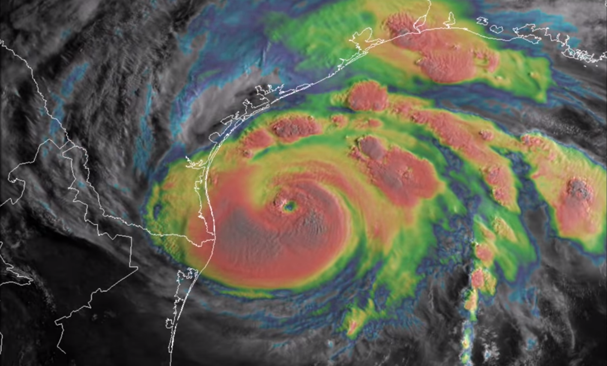
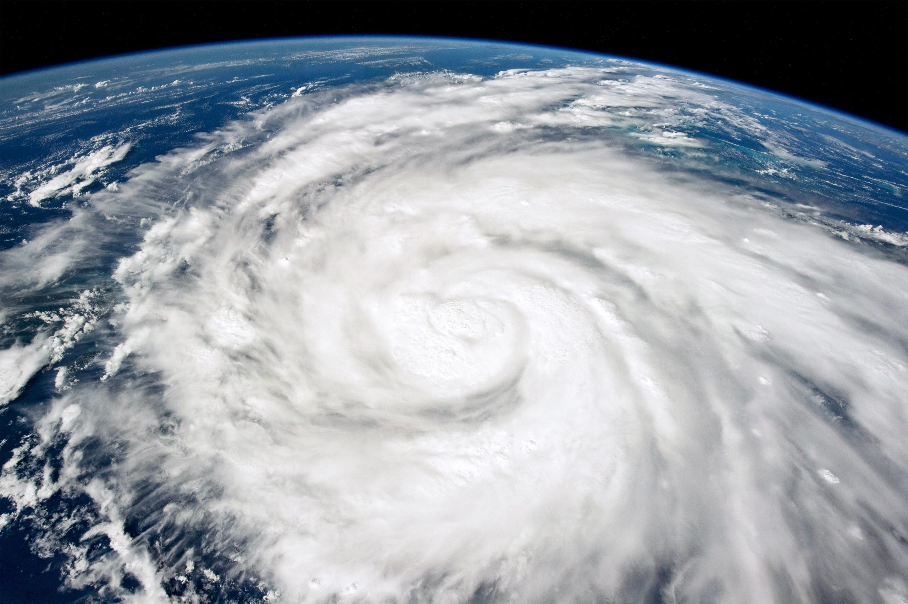

When a hurricane is born deep in the tropics, it begins as a swirl, a twist of wind on a warm patch of the ocean. It is silent and invisible to us on the ground, but for the astronauts in space? It would be a sight to behold, and sometimes, a chance to act fast. 

# Inception of a Storm

Storms begin in the tropical oceans, where **sea surface temperatures (SST)** above 26.5℃ (80℉) feed energy into the atmosphere [[1]](https://education.nationalgeographic.org/resource/hurricanes-cyclones-and-typhoons-explained/). This birth is first detected from above by a sophisticated network of technology.

Geostationary satellites, like the GOES (Geostationary Operational Environmental Satellite) series, act as the first sentinels. They provide near real-time imagery, allowing meteorologists at the National Weather Service (NWS) and global forecasting centers to track large-scale cloud and moisture systems continuously.

*GOES satellite image: overhead view capturing the structure and size of a storm system.*

For a more detailed look, polar-orbiting satellites (like Landsat and Sentinel) offer high-resolution imagery, capturing specifics like land interaction and cloud texture as they pass over the same area every 12 hours or so. Back on Earth, a network of ground-based Doppler radars tracks wind motion and precipitation intensity, while ocean buoys, ships, and aircraft collect direct measurements of atmospheric pressure, temperature, and wave height.

All this information—from space, land, and sea—feeds into sophisticated weather models. Using data assimilation techniques and machine learning, these models integrate all inputs to produce forecasts, predicting a storm's path and intensity.

*Storm off the coast of Hanoi captured by Himawari-8 — watch the swirling formation and intensification over time. Source: [Zoom Earth](https://zoom.earth)*

# The Human Element

So, if we have this robust, automated network for storm tracking, why do we ask astronauts to take photos of storms from the International Space Station (ISS)?

The answer is in perspective and flexibility. While satellites typically offer a top-down, two-dimensional view, astronauts can capture storms from oblique angles. This unique vantage point reveals the three-dimensional structure of a storm showing cloud structures, light/shadow interplay, and the shape of the eye wall in a way that flat images cannot.

These photographs also serve as crucial validation points for satellite data, helping to confirm cloud heights, storm symmetry, and even lightning activity. Moreover, an astronaut’s intuition allows them to react to visual changes, adjust camera settings, and frame the storm dynamically - something automated sensors aren't programmed to do.

*A crew member onboard the International Space Station took this photograph of Hurricane Ian on September 26 while orbiting more than 400 kilometers (250 miles) above Earth’s surface. Source: NASA.*

# Why the ISS Isn't a Primary Weather Satellite

While its vantage point is unique, the ISS isn't designed to be a primary weather-monitoring platform. Its orbit is one reason; with an inclination of 51.6°, it doesn't pass over the same location with the high frequency of a dedicated, sun-synchronous satellite. Additionally, the ISS is a bustling laboratory, and vibrations from daily operations and dockings can affect the stability needed for precision imaging.

That said, speacialized instruments like **ECOSTRESS** have been successfully deployed on the ISS for other forms of Earth observation. 

Ultimately, astronaut photos of storms may be a small piece of the puzzle, but they offer something no model or satellite can: a human glimpse of the Earth, seen from just above the clouds. They are a beautiful and scientifically valuable complement to the global network of radars, buoys, satellites, and supercomputers.

*This post was inspired by Samantha Harvey's beautiful novel, Orbital.*